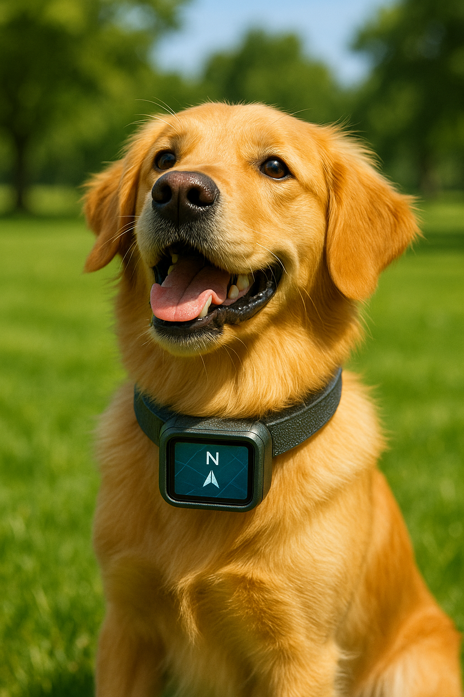

### Have you ever dreamed of a *Smart Pet* which can be trained in modern world based on modern approaches?

<p align="center">
  
  <br/>
  <sub><b>Prototype 1</b></sub>
</p>
<p align="center">
  
  <br/>
  <sub><b>Prototype 2</b></sub>
</p>
<p align="center">
  <sub><b>Prototype: Smart Pet Necklace for Command-based Navigation</b></sub>
</p>

#### Trying to Build VLN-CE model and integrate the latest novel improvements and architectural patterns

###### The core purpose of this project is to build a **Software 2.0** style model for my pet necklace to help him navigate in in-door environments based on my voice commands through vibrator in his/her necklace.


### Features:
- [x] PointNet++ for 3D object detection and scene segmentation
- [x] using [AI2THOR](https://ai2thor.allenai.org) as indoor data generation.
- [x] [VLN-CE](https://github.com/jacobkrantz/VLN-CE) Model for Vision-and-Language Navigation in Continuous Environments
- [x] command-based navigation system using (Matterport3D)[https://niessner.github.io/Matterport/#download] for Vision-and-Language Navigation in Continuous Environments(VLN-CE)

- Improvement specific to VLN-CE:
    - [x] Using a custom environment for VLN-CE that implements the *Gymnasium* interface. This provides similar functionality to *Habitat* but with a simpler implementation.
    - [x] Replace simple cross-attention with **cross-modal transformers** like those in ViLBERT
    - [x] Use ViT for visual encoding to better capture object-level semantics.
    - [x] Use BERT, RoBERTa, or DistilBERT for language understanding. (DistilBERT is implemented but you can change config files based on your preferences
    - [x] Integrating explicit depth fusion strategies to visual encoders, you can specify the fusion strategy in the config file for each specific encoder.

### Future:

- [ ] generate physics-based data using [AI2THOR](https://ai2thor.allenai.org) and integrate physics-informed models
- [ ] implementing VLN_CE model using [Habitat-Lab](https://github.com/facebookresearch/habitat-lab) instead of [Gymnasium](https://arxiv.org/abs/2407.17032)
- [ ] training on [ScaleVLN](https://scalevln.github.io) dataset for better generalization. (needs GPU 🥲

- Specific to VLN-CE:

    - [ ] integrate [Language-Aligned Waypoint (LAW) Supervision for Vision-and-Language Navigation in Continuous Environments](https://3dlg-hcvc.github.io/LAW-VLNCE/?utm_source=chatgpt.com) into VLN-CE model
    - [ ] integrate [EnvEdit: Environment Editing for Vision-and-Language Navigation](https://arxiv.org/pdf/2203.15685) into VLN-CE model for data augmentation
    - [ ] integrate [VLN-PETL: Parameter-Efficient Transfer Learning for Vision-and-Language Navigation](https://arxiv.org/pdf/2308.10172) for reducing computational costs
    - [ ] integrate [Dynam3D: Dynamic Layered 3D Tokens Empower VLM for Vision-and-Language Navigation](https://arxiv.org/pdf/2505.11383)

### Ref:
- [PointNet++](https://github.com/fxia22/pointnet2) for 3D object detection and scene segmentation
- [VLN-CE](https://github.com/jacobkrantz/VLN-CE) for Vision-and-Language Navigation in Continuous Environments
- [Beyond the Nav-Graph: Vision-and-Language Navigation in Continuous Environments](https://arxiv.org/pdf/2004.02857) for VLN-CE
- [AI2THOR](https://ai2thor.allenai.org) for indoor data generation
- [Habitat-Lab](https://github.com/facebookresearch/habitat-lab) for indoor data generation


### Tracking VLN-CE loss after each improvement for just 30 episodes:
- changing simple CorssModalAttention to ViLBERT and CrossModalTransformer improved the generalization by **18.1%**
- improving **memory management**, optimization strategy and tuning learning rate and initialization plus using pre-trained encoders like **DistilBERT**, **ViT encoder** and **MobileNet** lang-encoder dropped loss by **98%** to *0.026* and lead to performance prior to last stage and basic strcuture in contrast with being more computationally expensive. memory management is more efficient and also leads to overfit. data augmentation is needed for better data and it's gonna be the next stage to tune dataset for more diverse set of instructions and pathways.
- Integrating explicit depth fusion strategies to visual encoders improved performance by **11.54%** prior to the previous stage and dropped the loss to *0.023*.
 


##### Usage:

- to start training PointNet++ for 3D object detection and scene segmentation on AI2THOR dataset:
```bash
python3 script/train.py --conifg configs/PointNetPP.json --model PointNetPP
```

- to start training VLN-CE for Vision-and-Language Navigation in Continuous Environments on [VLN-CE](https://jacobkrantz.github.io/vlnce/data) dataset:
```bash
python3 script/VLN_CE/main.py
```